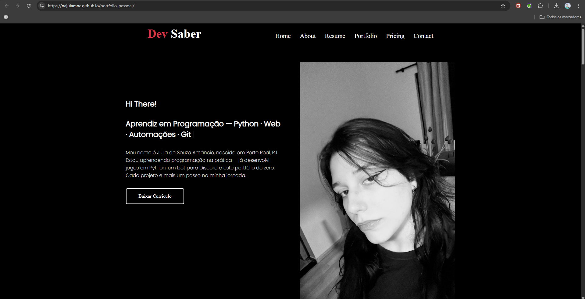

# 🌐 Portfólio Pessoal — Julia Amancio

> Landing page profissional e responsiva desenvolvida para exibição de projetos, serviços e informações pessoais. Construída do zero com HTML, CSS e JavaScript puro.

🔗 **[Ver online](https://najuiamnc.github.io/portfolio-pessoal/)**

---

## ✨ Funcionalidades

- ⚡ Animação de digitação no título (typing effect)
- 🎨 Design dark com tema vermelho e preto
- 📂 Filtro de projetos por categoria (Python, Web, Bot, Dados)
- 🔍 Lightbox para ampliar imagens dos projetos
- 🔗 Botão "Ver no GitHub" individual por projeto
- 📱 Layout responsivo para mobile e desktop
- 🧭 Menu hamburguer no mobile
- 🎬 Animações de entrada nas seções

---

## 🛠️ Tecnologias


---

## 📸 Preview



---

## 📁 Estrutura

```
portfolio-pessoal/
├── index.html
├── style.css
├── script.js
└── img/
    ├── julia.png
    ├── quiz_game.png
    ├── bot_discord.png
    ├── dashboard.png
    └── ...
```

---

## ▶️ Como rodar localmente

```bash
# Clone o repositório
git clone https://github.com/najuiamnc/portfolio-pessoal

# Abra o arquivo no navegador
# Ou use a extensão Live Server no VS Code
```

---

## 👩‍💻 Autora

Feito com 💜 por **Julia Amancio**  
[](https://github.com/najuiamnc)
